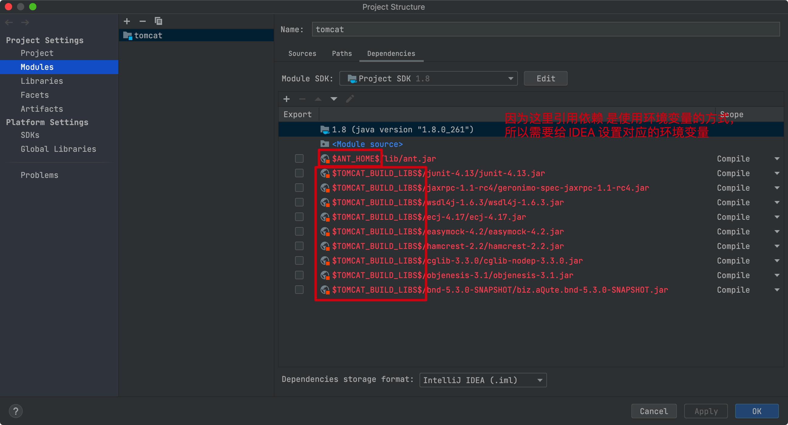
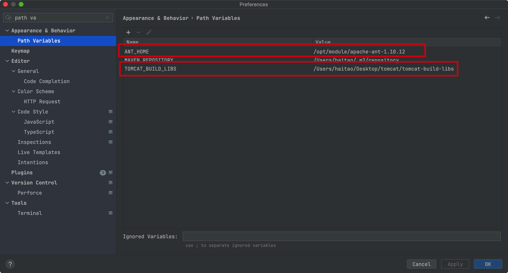
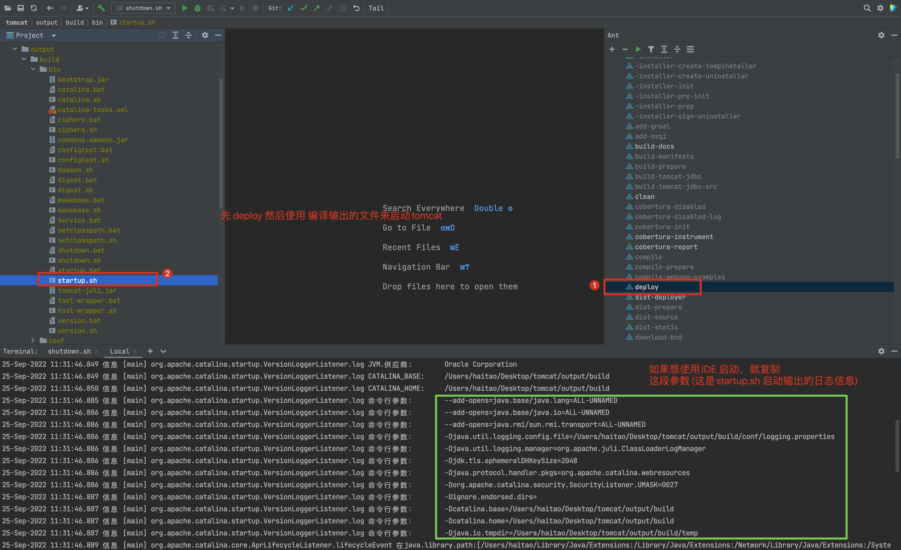
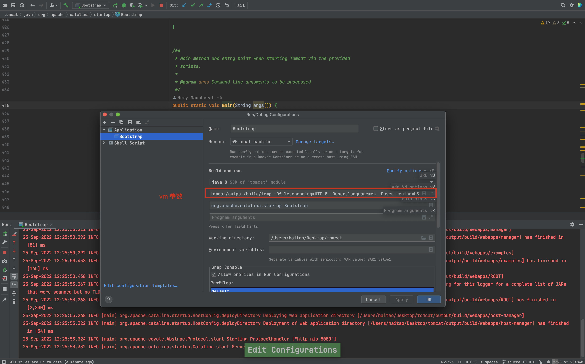

# 本地运行tomcat源码

## IDE 配置

1. 下载代码 `git clone git@github.com:haitaoss/tomcat.git`

2. 下载 Ant，我下载的版本是 1.10.12 `https://ant.apache.org/bindownload.cgi`

3. 配置环境变量
    ```shell
    export ANT_HOME=/opt/module/apache-ant-1.10.12
    export PATH=$PATH:$ANT_HOME/bin
    ```
    
4. 修改 Ant 下载依赖的目录
   ```shell
   $ pwd
   /Users/haitao/Desktop/tomcat
   
   $ echo "base.path=./tomcat-build-libs" > ./build.properties
   ```
   
5. 修改 IDE生成配置文件的模板(因为有个依赖的名字写错了)
   ```shell
   $ pwd
   /Users/haitao/Desktop/tomcat
      
   $ vim ./res/ide-support/idea/tomcat.iml
   
   # 注意这个名字是 ant 下载出来的依赖，要改成你本地下载依赖的名字
   # 将 bnd-5.1.1/biz.aQute.bnd-5.1.1.jar 改成 bnd-5.3.0-SNAPSHOT/biz.aQute.bnd-5.3.0-SNAPSHOT.jar
   ```
   
6. 使用 Ant 生成对应 IDE 的配置文件
    ```shell
    $ pwd
    /Users/haitao/Desktop/tomcat
    
    $ ant ide-intellij
    ```
7. 配置 IDEA 环境变量，不然识别不到依赖(改完还不生效 就重启IDEA)
    
    

## 启动编译后的Tomcat

### 方式一：脚本方式

> 查看日志`tail -fn 200 /Users/haitao/Desktop/tomcat/output/build/logs/catalina.out`



### 方式二：IDE 源码启动

```shell
-Djava.util.logging.config.file=/Users/haitao/Desktop/tomcat/output/build/conf/logging.properties
-Djava.util.logging.manager=org.apache.juli.ClassLoaderLogManager
-Djdk.tls.ephemeralDHKeySize=2048
-Djava.protocol.handler.pkgs=org.apache.catalina.webresources
-Dorg.apache.catalina.security.SecurityListener.UMASK=0027
-Dcatalina.base=/Users/haitao/Desktop/tomcat/output/build
-Dcatalina.home=/Users/haitao/Desktop/tomcat/output/build
-Djava.io.tmpdir=/Users/haitao/Desktop/tomcat/output/build/temp
-Dfile.encoding=UTF-8
-Duser.language=en
-Duser.region=US
```




## 如何 Debug 部署的项目